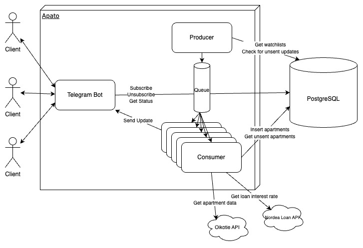

# Apato (WIP)

[](https://opensource.org/licenses/MIT)
[](https://x.com/JernLinus)


Apato is a subscription service built to give you an edge on the competitive real estate market. Apato lets you subscribe to certain areas of interest and pings you whenever a listing matching your investment criteria appears on the market. No more tedious manual searching and long hours of excel models.

### Features

- **Get pinged when a investment opportunity appears on the market** Let's you subscribe to a watchlist with your investment criteria (target IRR, size, location).
- **Get accurate IRR immediately** Calculates the [Internal Rate of Return](https://en.wikipedia.org/wiki/Internal_rate_of_return) for all apartments listed in your watchlists.
- Notifies you whenever a new apartment that matches your criteria comes to market.
- Can handle multiple users, from multiple chats.

## How is Apato built?

Technologies used:

- [Rust](https://www.rust-lang.org/)
- [Diesel](https://diesel.rs/)
- [Postgresql](https://www.postgresql.org/)
- [Teloxide](https://github.com/teloxide/teloxide)

Apato is designed using the Producer-Consumer pattern. High level functionality goes approximately like this:

1. User subscribes to watchlist via Telegram.
2. Producer pushes update and calculation tasks to the task queue.
3. Consumer processes tasks. Sends update or calculates IRR for all apartments of given watchlist.



### IRR Calculations

Apato uses real cash flow IRR calculations to estimate yield of investments.
The source code can be found in `src/consumer/calculations.rs`.

[IRR is a classic problem](https://www.investopedia.com/terms/i/irr.asp#:~:text=The%20Formula%20for,is%20as%20follows%3A) where one wants to find the roots of a polynomial of a high degree. In this case the degree is equal to the length of the loan (25 by default).

Apato solves for the roots by evaluating the eigenvalues of the companion matrix to the given cashflow.

## Deployment

To run locally, make sure to have Rust and Docker installed.

First, spin up the database.

```
docker-compose up -d
```

Run migrations:

```
diesel setup
```

Run Apato:

```
cargo run
```

## Bot commands

Subscribe to a watchlist at location `id` and set the wanted yield to be `yield`

```
   /sub {location id} yield={yield} size={size}
```

Unsubscribe to a watchlist with watchlist id `id`

```
   /unsub {watchlist_id}
```

Lists all the current watchlists of the caller

```
   /listsubs
```

Get information about all apartments currently in the watchlist of interest.

```
   /getall {watchlist_id}
```

Get information about all apartments matching your investment criteria in the watchlist of interest.

```
   /getallvalid {watchlist_id}
```

Helper for all commands

```
   /help
```

## Improvements

TODO
